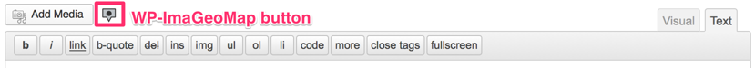

# WP-ImaGeoMap

画像と地図を組み合わせて記事に貼り付ける、WordPress プラグインです。

## 使い方

1. 投稿ページを表示します
2. メディア ボタン（マーカーのような画像です）を押します
3. 編集ダイアログでデータを作成します
4. 「投稿に挿入」ボタンを押します
5. 記事にショートコードが挿入されます

プラグインの詳細については、以下のページに解説しています。

* [WP-ImaGeoMap - アカベコマイリ](http://akabeko.me/blog/software/wp-imageomap/)

## スクリーンショット

### WP-ImaGeoMap

### メディア ボタン

### 編集

## ライセンス

* [GNU GENERAL PUBLIC LICENSE Version 2](LICENSE.txt)

## 開発情報

開発に関する情報は Redmine で管理しています。

* [WP-ImaGeoMap - Redmine](http://akabeko.me/projects/projects/wp-imageomap)
