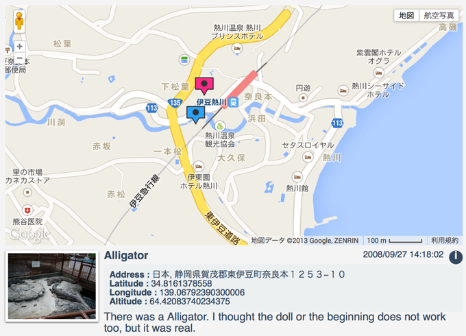
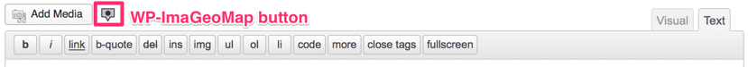
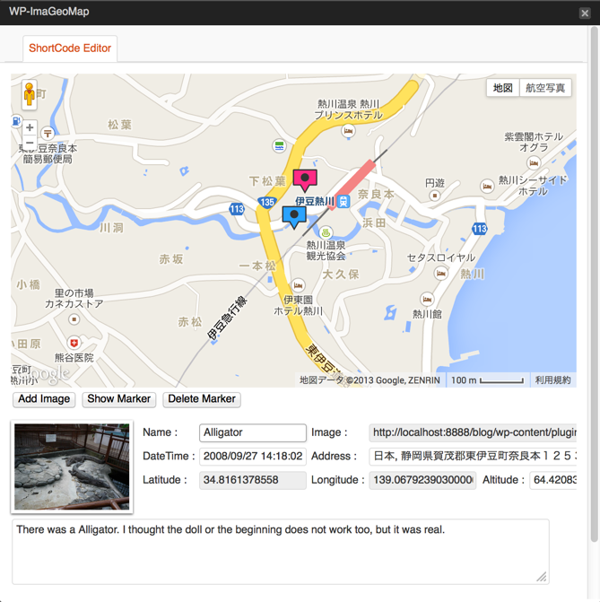

# WP-ImaGeoMap

It is WordPress plug-in for insertion in an article by combining a map and image.

## How to use

1. Show me the post page
2. Press the Wp-ImaGeoMap (looks like a marker) from the media button
3. Edit the data in the editor window
4. Press the 'Insert into Post' button
5. Short code will be inserted into the post

More information refer to the following pages.

* [WP-ImaGeoMap - AKABEKOMAIRI](http://akabeko.me/blog/software/wp-imageomap/)

## Screenshots

### WP-ImaGeoMap

### Media button

### Editor

## Licence

* [GNU GENERAL PUBLIC LICENSE Version 2](LICENSE.txt)

## Development

Managed by Redmine development information.

* [WP-ImaGeoMap - Redmine](http://akabeko.me/projects/projects/wp-imageomap)
